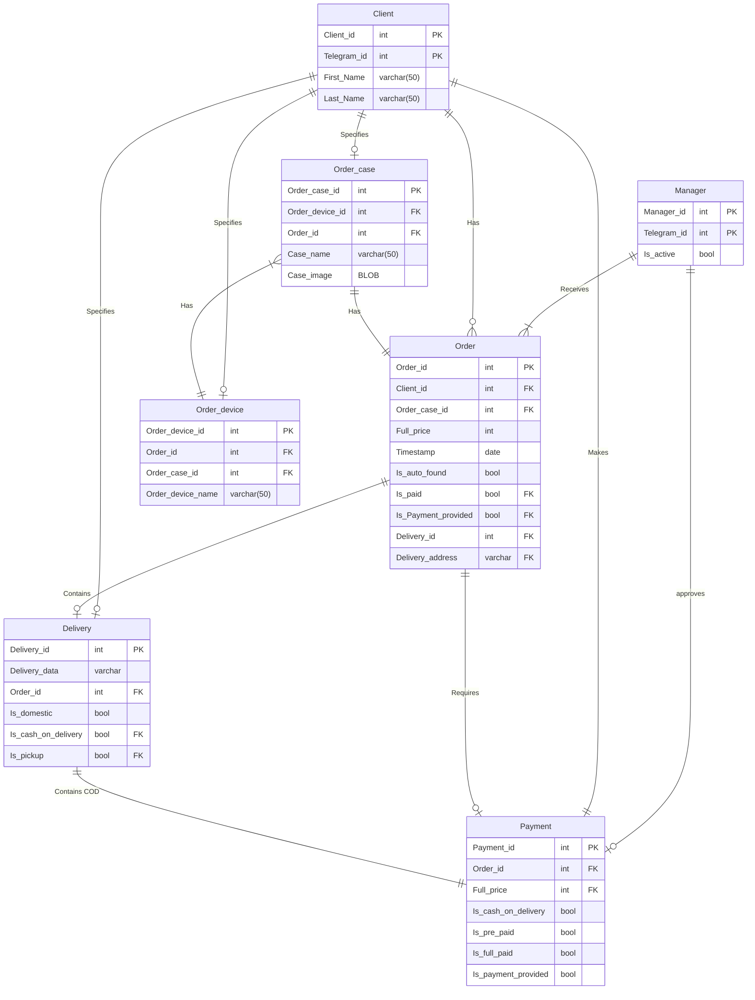

ER Diagram

```mermaid

erDiagram

    Manager {
        Manager_id int PK
        Telegram_id int PK
        Is_active bool
        %% Is_active True by default
    }

    Client {
        Client_id int PK
        Telegram_id int PK
        First_Name varchar(50)
        Last_Name varchar(50)
        %% Other attributes specific to Clients
    }

    Order {
        Order_id int PK
        Client_id int FK
        Order_case_id int FK
        Full_price int 
        Timestamp date

        Is_auto_found bool
        Is_paid bool FK
        Is_Payment_provided bool FK

        Delivery_id int FK
        Delivery_address varchar FK
        %% Other attributes for the Order
    }

    Order_device {
        Order_device_id int PK
        Order_id int FK
        Order_case_id int FK
        Order_device_name varchar(50)
    }

    Order_case {
        Order_case_id int PK
        Order_device_id int FK
        Order_id int FK
        Case_name varchar(50)
        Case_image BLOB 
    }

    Payment {
        Payment_id int PK
        Order_id int FK
        Full_price int FK
        Is_cash_on_delivery bool
        Is_pre_paid bool

        Is_full_paid bool 
        Is_payment_provided bool
        %% Other attributes for the Order
    }

    Delivery {
        Delivery_id int PK
        Delivery_data varchar
        Order_id int FK
        Is_domestic bool
        Is_cash_on_delivery bool FK
        Is_pickup bool FK
        %% Is_domestic True by default
        %% Is_cash_on_delivery False by default; International is without COD
    }

    


%% May has one or more ||--|{ Has only one
%% |o	o|	Zero or one
%% ||	||	Exactly one
%% }o	o{	Zero or more (no upper limit)
%% }|	|{	One or more (no upper limit)

    Manager ||--o| Payment:"approves"
    Manager ||--}| Order:"Receives"

    Client ||--o{ Order:"Has"
    Client ||--|| Payment:"Makes"
    Client ||--o| Delivery:"Specifies"
    Client ||--o| Order_device:"Specifies"
    Client ||--o| Order_case:"Specifies"

    Order ||--o| Payment:"Requires"
    Order ||--o| Delivery:"Contains"
    
    Order_case |{--|| Order_device:"Has"
    Order_case ||--|| Order:"Has"

    Delivery ||--|| Payment:"Contains COD"

```