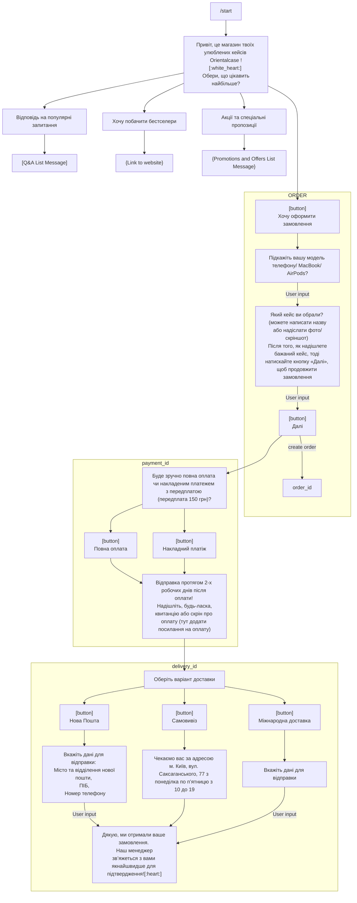

# Introduction
This file contains the main requirements related to the product

Links:
- [Q&A List Message](qa_list_message.md)
- [Promotions and Offers List Message](promotions_list_message.md):


# Textual requirements

```md
Структура боту: 
- Клієнт обирає <start>, щоб запустити бота
-> Привіт, це магазин твоїх улюблених кейсів Orientalcase [:white_heart:] Обери, що цікавить найбільше?
	- Хочу оформити замовлення  
		-> Підкажіть вашу модель телефону/ MacBook/ AirPods?[ відповідь клієнта ]
		-> Який кейс ви обрали?(можете написати назву або надіслати фото/скріншот)
		-> Після того, як надішлете бажаний кейс, тоді натискайте кнопку «Далі», щоб продовжити замовлення
		-> < кнопка далі >
		-> Буде зручно повна оплата чи накладеним платежем з передплатою? ( передплата 150 грн )
			- < кнопка повна оплата >  
			- < кнопка накладний платіж >
		-> Відправка протягом 2-х робочих днів після оплати! [:smiling_face_with_3_hearts:] Надішліть, будь-ласка, квитанцію або скрін про оплату[ тут додати посилання на оплату ]  
		-> Оберіть варіант доставки
			- < кнопка нова пошта >  
				- Вкажіть дані для відправки:
				  Місто та відділення нової пошти
				  ПІБ
				  Номер телефону
			- < кнопка самовивіз > 
				- Чекаємо вас за адресою м. Київ, вул. Саксаганського, 77 з понеділка по п’ятницю з 10 до 19
			- < кнопка міжнародна доставка >
				- ?
			- Дякую, ми отримали ваше замовлення, наш менеджер зв’яжеться з вами якнайшвидше для підтвердження![:heart:]
		
	- Відповідь на популярні запитання 
		- [Q&A List Message]

	- Хочу побачити бестселери  
		- ? [Link to website]

	- Акції та спеціальні пропозиції
		- [Promotions and Offers List Message]
```


# Mermaid flowchart



